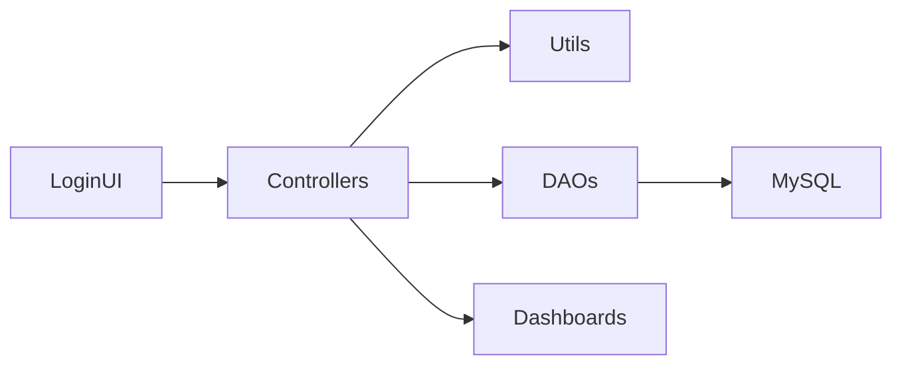

# PROJECT ARKO

A state-driven Java desktop system for **Pasig River Ferry Service** operations. Built with Java Swing and MySQL, it authenticates staff, processes passenger movement, manages vessels and stations, and exposes operational insight through reports — keeping passenger status, vessel load, and trip state synchronized at every station-to-station step.


---

## Features

- **Staff Auth & Session Management**: Secure login with jBCrypt credential hashing, role-based routing (`ADMIN` / `STAFF`), password change flows, and forgot-password email recovery via Gmail SMTP.
- **Operational Ferry Workflows**: Passenger registration, waitlist management, boarding and alighting, trip dock/depart/complete, river map tracking, and PDF boarding pass generation.
- **Smart Boarding Policy Engine**: Enforces boarding limits that balance downstream station fairness with physical vessel capacity, plus terminus and manifest-complete rules before trip completion.
- **Admin Master Data Controls**: Manage staff accounts, station topology, vessel inventory, and account security settings without touching source code or database consoles.
- **Ridership & Manifest Reporting**: Ridership timeline charts, passenger classification breakdowns, station boarding/alighting analytics, and trip manifest views powered by JFreeChart.

---

## Technology Stack

- **Language & UI**: Java 25, Java Swing (`javax.swing`)
- **Database**: MySQL via JDBC (`mysql-connector-j` 9.6.0)
- **Charts**: JFreeChart 1.5.4, jcommon 1.0.24
- **Security**: jBCrypt 0.4
- **Email**: Jakarta Mail API 2.1.3, Angus Mail 2.0.3
- **Build**: IntelliJ IDEA module (`PROJECT-ARKO-2.iml`) — no Maven or Gradle
- **Architecture**: MVC-like layering — views capture input, controllers orchestrate logic, DAOs handle persistence, utilities enforce cross-cutting policy and session rules

---

## Project Structure

```text
PROJECT-ARKO-2/
├── src/com/arko/
│   ├── view/              # Swing UI (login, admin, operational, reports)
│   ├── controller/        # Request orchestration and workflow logic
│   ├── model/
│   │   ├── POJO/          # Entity objects (Passenger, Trip, Vessel, Station, Staff)
│   │   ├── DAO/           # JDBC data access
│   │   └── database/      # DBConnection, TransactionRunner, DBConfig
│   └── utils/             # Session, auth, email, operational policy helpers
├── lib/                   # External JAR dependencies (not tracked in repo)
├── docs/                  # Technical documentation suite
├── PROJECT-ARKO-2.iml     # IntelliJ module definition
└── README.md              # Project documentation
```

---

## Getting Started

### Prerequisites

- **JDK 25** (or a compatible JDK matching your IntelliJ project SDK)
- **IntelliJ IDEA** (recommended)
- **MySQL server** with a populated schema named `project_arko_db`
- **Local JAR dependencies** in `lib/` (referenced by `PROJECT-ARKO-2.iml`, not tracked in this repository)
- **UI icon assets** under `src/com/resources/Icons/` (may be missing from a fresh clone)

> This repository does not include SQL migration files. Expected tables: `passengers`, `trip`, `vessel`, `station`, `Staff`. Provision and populate the database separately before running.

### Installation

1. Clone the repository:
  ```bash
   git clone <repository-url>
   cd PROJECT-ARKO-2
  ```
2. Open the project in IntelliJ IDEA and confirm the `PROJECT-ARKO-2` module resolves with JDK 25.
3. Place required JAR files in `lib/` at the project root. See [Dependencies](#-dependencies) for the full list.
4. Configure the database in `[src/com/arko/model/database/DBConfig.java](src/com/arko/model/database/DBConfig.java)`:
  - `HOST` — database host (`localhost` for local dev; change only this for LAN demo)
  - `PORT` — MySQL port (default `3306`)
  - `DATABASE` — schema name (`project_arko_db`)
  - `USER` / `PASSWORD` — MySQL credentials
5. *(Optional)* Configure Gmail SMTP in `[src/com/arko/utils/Email/EmailConfig.java](src/com/arko/utils/Email/EmailConfig.java)` for password recovery and new-account emails. Core login and operations work without SMTP.

### Running the Application

1. In IntelliJ, run the main entry point:
  - **Class**: `com.arko.view.Login.LoginPanel`
  - **Method**: `LoginPanel.main()` in `[src/com/arko/view/Login/LoginPanel.java](src/com/arko/view/Login/LoginPanel.java)`
2. Log in with a valid staff account. Post-login routing via `[DashboardAccess.java](src/com/arko/utils/Login/DashboardAccess.java)`:

  | Role    | Dashboard                                          |
  | ------- | -------------------------------------------------- |
  | `ADMIN` | Admin Dashboard — entity management and reports    |
  | `STAFF` | Operational Dashboard — day-to-day ferry workflows |

3. Smoke test the environment:
  - Confirm correct role-based dashboard loads
  - Trigger a data read (waitlist or report panel)
  - Verify no JDBC connection or session exceptions

---

## 🔌 Application Entry Points

### `LoginPanel.main()`

Bootstraps the Swing application and displays the login screen.

### Role-Based Dashboard Routing

After successful authentication, `DashboardAccess` routes users by role:

- `**ADMIN*`* → `AdminDashboard` (manage users, stations, vessels, reports, account settings)
- `**STAFF**` → `OperationalDashboard` (register, board, alight, trip control, map tracking)

### Configuration Files

All runtime settings are code-backed (no `.env` files):


| Concern  | File                                                            | Key Settings                                     |
| -------- | --------------------------------------------------------------- | ------------------------------------------------ |
| Database | `[DBConfig.java](src/com/arko/model/database/DBConfig.java)`    | Host, port, database name, user, password        |
| Email    | `[EmailConfig.java](src/com/arko/utils/Email/EmailConfig.java)` | Sender email, Gmail app password, SMTP host/port |


> **Security note:** Database and email credentials are hardcoded in source. Override locally before sharing builds or deploying outside development.

---

## Architecture & Domain Model

Every request follows the same spine: **View** → **Controller** → **Utils** → **DAO** → **MySQL** → UI refresh.




**Passenger states:** `WAITING` → `BOARDED` → `ARRIVED`

**Trip states:** `DOCKED` → `IN TRANSIT` → `COMPLETED`

Capacity checks, direction guards, and terminus rules are jointly enforced by policy logic in the utility layer and SQL guard conditions in the DAO layer.

For the full system map, see [docs/ARCHITECTURE.md](docs/ARCHITECTURE.md).

---

## Dependencies

External JARs expected in `lib/`:


| JAR                      | Version |
| ------------------------ | ------- |
| `mysql-connector-j`      | 9.6.0   |
| `jfreechart`             | 1.5.4   |
| `jcommon`                | 1.0.24  |
| `jbcrypt`                | 0.4     |
| `jakarta.mail-api`       | 2.1.3   |
| `jakarta.activation-api` | 2.1.3   |
| `angus-mail`             | 2.0.3   |
| `angus-activation`       | 2.0.2   |


---

## Known Limitations

- **No build tool wrapper** — IntelliJ-first workflow; no Maven, Gradle, or shell run scripts.
- **Incomplete clone artifacts** — `lib/` JARs and `src/com/resources/Icons/` may need to be supplied separately.
- **No SQL schema in repo** — database must be provisioned manually to match DAO expectations.
- **Hardcoded credentials** — override `DBConfig.java` and `EmailConfig.java` before deployment.

---

## 📝 License

License not specified.
